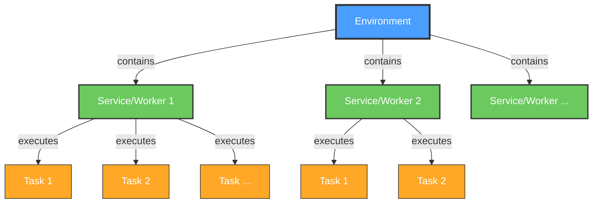

# Appose Workshop

## Interprocess Cooperation with Shared Memory

Curtis Rueden @ UW-Madison LOCI  
"Halfway to I2K" 2025

<div class="pt-12">
  <span @click="$slidev.nav.next" class="px-2 py-1 rounded cursor-pointer" hover="bg-white bg-opacity-10" style="font-size: 2em">
    Press <kbd style="font-size: 1em">Space</kbd> to begin <carbon:arrow-right class="inline"/>
  </span>
</div>

<div class="pt-12 text-sm opacity-75">

**SLIDES:** `https://fiji.github.io/i2k-2025-appose/`

</div>
---
layout: default
---

# What is Appose?

## "Interprocess cooperation with shared memory"

<v-clicks>

- 🔄 **Interprocess** - Multiple processes connected via communication protocol
- 🤝 **Cooperation** - Build environments, start services, run tasks
- 💾 **Shared Memory** - Cross-platform, cross-language memory buffers

</v-clicks>

---
layout: default
---

# What Appose is NOT

## Appose ≠ Fiji's Python Mode

**Python Mode:** Runs Python in the *same process* as Java
- Powered by PyImageJ (imglyb, scyjava, jgo, jpype) and enabled by Jaunch

<div class="grid grid-cols-2 gap-4 mt-4">

<div>

<v-click>

### Pros ✅
- Memory can be shared directly
- Java objects wrapped as Python objects via JPype
- Write true Python (CPython, not Jython) scripts in Fiji's Script Editor

</v-click>

</div>
<div>

<v-click>

### Cons ❌
- Fiji can only run in Python mode with **one environment at a time**
- No switching between deep learning tools with incompatible dependencies
- All tools must share the same Python environment

</v-click>

</div>
</div>

<v-click>

<div style="margin-top: -1em">

### Appose solves this!
Multiple isolated environments, each with their own dependencies, running simultaneously.

</div>

</v-click>

---
layout: default
---

# Interprocess

Multiple **processes** (programs) connected via communication protocol

<v-clicks>

## Examples

- Fiji (Java) → Python program
- napari (Python) → Java program
- Java ↔ Java
- Python ↔ Python
- Python ↔ R

</v-clicks>

::right::

<v-clicks>

### Pros ✅
- Called program doesn't need to "know about" caller
- Clean separation of concerns
- Use best tool for each job

### Cons ❌
- Each process has own memory space
- No direct memory sharing (traditionally)

</v-clicks>

---
layout: default
---

# Cooperation

How Appose facilitates<br>interprocess cooperation:

<div class="absolute top-10 right-10" style="width: 40rem;">



</div>

<div class="grid grid-cols-2 gap-4">

<div>

<v-click>

<br>

1. **Build Environment**
   - Using pixi, uv, or micromamba
   - No pre-installation needed
   - Everything downloaded on demand

</v-click>
<v-click>

<br>

2. **Start Service**
   - Worker process running in that environment
   - Stays alive for multiple tasks

</v-click>
<v-click>

</v-click>

</div>
<div style="margin-top: 5rem">

<v-click>

3. **Run Tasks**
   - Feed inputs, receive outputs
   - Via JSON serialization
   - Through the service/worker

</v-click>

</div>
</div>

---
layout: default
---

# Shared Memory

Cross-platform, cross-language support for named shared memory buffers

<v-click>

## Built into Python

```python
from multiprocessing.shared_memory import SharedMemory
```

</v-click>
<v-click>

## Appose Extension

```python
from appose import SharedMemory
```

</v-click>
<v-click>

## Java Implementation

```java
import org.apposed.appose.SharedMemory;
```
New class modeled closely after Python's implementation

**Result:** Efficient sharing of large data (images!) without serialization overhead

</v-click>

---
layout: default
---

# N-dimensional Arrays

Shared memory with structural metadata (**images**!)

`NDArray` = `SharedMemory` + dtype + shape

<div class="absolute top-10 right-10" style="z-index: 1">

<v-click>

## Python: NumPy-compatible

```python
import appose

# Create shared memory NDArray
data = appose.NDArray("uint16", [2, 20, 25])

# Access as NumPy array
numpy_array = data.ndarray()
```

</v-click>
<v-click>

**🤔 How does that work under the hood?**
```python
numpy.ndarray(
    prod(data.shape), dtype=data.dtype, buffer=data.shm.buf
).reshape(data.shape)
```
</v-click>

</div>

<v-click>

<div style="margin-top: 1.5rem">

## Java: ImgLib2-compatible

```java
import org.apposed.appose.NDArray;
import net.imglib2.appose.*; // ShmImg, NDArrays

// Receive NDArray from Python (via task.outputs)
ShmImg<FloatType> img = new ShmImg<>(ndarray);

// Or create and send to Python (as a task input)
NDArray ndarray = NDArrays.ndArray(new FloatType(), 4, 3, 2);
Img<FloatType> img = NDArrays.asArrayImg(ndarray, new FloatType());

// Or copy to ShmImg from existing (presumably non-shm) Img
Img<FloatType> sharedCopy = ShmImg.copyOf(someOtherImg);
// See also net.imglib2.util.ImgUtil.copy(srcImg, destImg)
```

</div>

</v-click>

---
layout: center
class: text-center
---

# Live Demos

Real-world Appose integrations in action

---
layout: center
---

# Demo 1: SAMJ

<div style="position: absolute; right: 3rem; margin-top: -10rem; z-index: 1">


</div>

One-click live segmentation

- Segment Anything Model integration
- Python AI model called from Java
- Interactive segmentation UI

https://github.com/segment-anything-models-java/SAMJ-IJ

*Help › Update... › Manage Update Sites › SAMJ*

---
layout: center
---

# Demo 2: TrackMate

<div style="position: absolute; right: 2rem; margin-top: -10rem; z-index: 1">


</div>

Deep learning spot detectors

- v9-appose branch
- Python-based detection in Java application
- Real-time particle tracking

https://github.com/trackmate-sc/TrackMate/tree/v9-appose  

Run `fiji/plugin/trackmate/TrackMatePlugIn.java` in IDE

---
layout: center
---

# Demo 3: Mastodon

<div style="position: absolute; right: 2rem; margin-top: -10rem; z-index: 1">


</div>

Large-scale tracking capabilities

- Cell detection and tracking with Python deep learning models
- Powered by Appose + Cellpose3 + TrackAstra
- Proof-of-concept stage: best to use Linux

https://github.com/mastodon-sc/mastodon-deep-lineage/

*Help › Update... › Manage Update Sites › Mastodon* + *Mastodon-DeepLineage*

---
layout: default
---

# Mastodon Demo: Dataset

Using TGMM mini example dataset

**Download from:**  
https://github.com/mastodon-sc/mastodon-example-data/tree/master/tgmm-mini

**Files needed:**
- `datasethdf5.h5` - Image data
- `datasethdf5.xml` - BDV metadata

<v-click>

**Create new Mastodon project** based on these two files

</v-click>

---
layout: default
---

# Mastodon Demo: Install Python Environments

Install the required Python environments via Appose

**Menu:** `Plugins › Tracking › Python environments for detectors/linkers`

<v-clicks>

- **Update/Install cellpose3** - Cell segmentation model
- **Update/Install trackastra** - Deep learning-based tracking

<div>

<div style="position: absolute; left: 4rem; margin-top: 1em; z-index: 1">


</div>

<div style="margin-left: 14rem">

```
error    libmamba Could not solve for environment specs
    The following packages are incompatible
    └─ pytorch-cuda =* * is not installable because there are no viable options
       ├─ pytorch-cuda 11.6 would require
       │  └─ cuda =11.6 *, which does not exist (perhaps a missing channel);
       ├─ pytorch-cuda 11.7 would require
       │  └─ cuda =11.7 *, which does not exist (perhaps a missing channel);
       └─ pytorch-cuda 11.8 would require
          └─ cuda =11.8 *, which does not exist (perhaps a missing channel).
critical libmamba Could not solve for environment specs
[ERROR] Installation failed for cellpose3
```

</div>

</div>

</v-clicks>

---
layout: default
---

# Mastodon Demo: Detection with Cellpose3

**Menu:** `Plugins › Tracking › Detection › Cellpose3`

<v-click>

**Settings to adjust:**

| Parameter | Value | Notes |
|-----------|-------|-------|
| Estimated diameter | 25 | Cell size in pixels |
| GPU usage | 1.0 | Use full GPU (if available) |

</v-click>
<v-click>

**Run detection**
- Takes 3-5 minutes on laptop, or less than 1 minute on workstation
- Cellpose runs in Python via Appose, results sent back to Mastodon

</v-click>

---
layout: default
---

# Mastodon Demo: Linking with TrackAstra

**Menu:** `Plugins › Tracking › Linking › TrackAstra`

<v-click>

**Settings:**
- Leave default parameters
- TrackAstra uses deep learning for tracking

</v-click>
<v-click>

**Run linking:**
- Links detected cells across timepoints
- Creates complete cell lineage tracks
- All computation happens in Python via Appose

</v-click>
<v-click>

**Platform note:** Tested on Linux and Windows. Detection works on both; linking works best on Linux.

</v-click>

---
layout: center
class: text-center
---

# Hands-On Workshop

**Build your own Appose-powered tool in Fiji**

<div class="pt-4">
Goal: Integrate UNSEG with Fiji via Appose
</div>

<div class="pt-8 text-sm opacity-75">
⏱️ ~90 minutes
</div>

---
layout: default
---

# Workshop Overview

## What we'll build:

Fiji plugin (Groovy script) that calls UNSEG for nucleus/cell segmentation

**UNSEG:** Unsupervised segmentation of cells and their nuclei in tissue  
https://github.com/uttamLab/UNSEG

<v-clicks>

## What you'll learn:

- Setting up Python environments with pixi
- Adapting Python code for Appose
- Writing Fiji scripts that call Python
- Debugging cross-language integration

</v-clicks>

---
layout: default
---

# Prerequisites

**Required:**
- Fiji installed

**Recommended:**
- bash terminal
- pixi
- git
- vim (or your favorite text editor)
- claude (or your favorite AI assistant)

**Can follow along without coding&mdash;just watch!**

---
layout: center
class: text-center
---

# 👩‍💻 Let's Code! 👨‍💻

**Follow along or just watch**

We'll go through all the steps together!

💡 Stuck? Clone reference repo:
```bash
git clone https://github.com/ctrueden/unseg-fiji
```

Use tags to jump to any step:
```bash
git checkout step03
```

Or to view changes for a particular step:
```bash
git show step04
```

---
layout: default
---

# Step 0: Initialize Project

<v-click>

Create a dedicated folder for this project:

```bash
mkdir ~/Desktop/unseg-fiji
cd ~/Desktop/unseg-fiji
```

</v-click>
<v-click>

Initialize an empty pixi project skeleton:

```
pixi init
```

**💡 Install pixi from: https://pixi.sh/latest/installation/**

</v-click>
<v-click>

**This creates `pixi.toml`**: the environment specification

</v-click>
<v-click>

**🎯 Checkpoint:** `git init && git add . && git commit -m 'Add initial project skeleton'`

</v-click>

---
layout: default
---

# Step 1: Clone UNSEG

Get the UNSEG repository from GitHub:

```bash
git clone https://github.com/uttamLab/UNSEG
cp UNSEG/unseg.py .
unzip UNSEG/image.zip
```

<v-click>

**What's in here?**
- `unseg.py` - The segmentation algorithm
- `run_unseg.ipynb` - Jupyter notebook showing how to use it
- `requirements.txt` - Python dependencies
- `image.zip` - Sample image data

</v-click>

<v-click>

**🎯 Checkpoint:** `git add unseg.py && git commit -m 'Add unseg script'`

</v-click>

---
layout: default
---

# Step 2: Create Test Script

Extract code from the Jupyter notebook into a Python script:

**Manual approach:**
1. Go to https://github.com/uttamLab/UNSEG in browser
2. Click into `run_unseg.ipynb`
3. Copy code blocks into text editor
4. Save as `run.py`

<v-click>

**Or use your AI assistant!** 🤖

</v-click>

<v-click>

**🎯 Checkpoint:** `git add run.py && git commit -m 'Add test script'`

</v-click>

---
layout: default
---

# Step 3: Import Dependencies

<v-click>

Import dependencies into pixi project:

```bash
pixi import UNSEG/requirements.txt --format pypi-txt --environment default
```

</v-click>

<v-click>

**This updates `pixi.toml`** environment specification.

</v-click>

<v-click>

**🎯 Checkpoint:** `git commit -a -m 'Add unseg dependencies from requirements.txt'`

</v-click>

---
layout: default
---

# Step 4: Adjust Dependencies

<v-click>

**1. Add needed dependencies:** `pixi add python=3.9 appose==0.7.2`

</v-click>
<v-click>

**2. Move packages from `pypi-dependencies` to `dependencies`**

</v-click>
<v-click>

**3. Test it:** `pixi run python run.py`

</v-click>
<v-click>

**Common issues to fix:**
1. `opencv-python` fails → move back to `pypi-dependencies`
2. Missing images → run `unzip UNSEG/image.zip`
3. Qt errors → change `opencv-python` to `opencv-python-headless`

</v-click>
<v-click>

**🎯 Checkpoint:** `git commit -a -m 'Update dependencies to first working version'`

</v-click>

---
layout: default
---

# Step 5: Adapt unseg.py for Appose

Make the library "listenable" by adding a callback mechanism:

<v-click>

Add at the top of `unseg.py`:

```python
report = print
def listen(callback):
    global report
    report = callback
```

</v-click>

<v-click>

Then replace all `print(` with `report(`.

**🤔 Why?** Allows calling code to capture progress updates via callback

</v-click>

<v-click>

**🎯 Checkpoint:** `git commit -m 'Change print statements to callback invocations' unseg.py`

</v-click>

---
layout: default
---

# Step 6: Append Running Code

Paste the contents of `run.py` at the bottom of `unseg.py`:

**Now we have a single file that:**
- Defines the library functions
- Includes example usage code
- Can be called as a script

<v-click>

**💡 This makes it easy to test the code standalone before integrating with Appose**

</v-click>

<v-click>

**Test it again:**
```bash
pixi run python unseg.py
```

</v-click>

<v-click>

**🎯 Checkpoint:** `git rm -f run.py && git commit -a -m 'Unify all code into one script'`

</v-click>

---
layout: two-cols
---

# Step 7: Refactor Image Loading Logic

* Simplify `open_img` to *only* open the image
* Move intensity channel selection to main script

**🤔 Why?** Prepares for images coming from Appose

<v-click>

**🎯 Checkpoint:**  
```bash
git commit \
    -m 'Split out channel selection logic' \
    unseg.py
```

</v-click>

::right::

```python
def open_img(path_to_img):
    """Returns the RGB image (img)"""
    return io.imread(path_to_img, plugin="tifffile")

def plot_img(img, tlt='', cmp='gray'):
    ...

# Path to image
path_to_img = './image/Gallbladder_Normal_Tissue.tif'

# Open and plot the original image
img = open_img(path_to_img)
plot_img(img, tlt='Image')

# Select intensity channels for processing: two channels
# with nuclei (DAPI) and cell membrane (Na+K+ATPase) markers
h = img.shape[0]
w = img.shape[1]
intensity = np.zeros((h,w,2), dtype='float64')
intensity[:,:,0] = img[:,:,2] # Nuclei Marker
intensity[:,:,1] = img[:,:,0] # Cell Membrane Marker
```

---
layout: default
---

# Step 8: Add "Appose Mode" to Script

Add Appose task handling to beginning of the main section:

```python
appose_mode = 'task' in globals()
if appose_mode:
    listen(task.update)
else:
    from appose.python_worker import Task
    task = Task()
```

<v-click>

**What this does:**
- Checks if running in Appose context (task exists) or standalone
- Connects our `listen` callback to Appose's `task.update` method
- Creates a dummy task object when running outside Appose

</v-click>

<v-click>

**🎯 Checkpoint:** `git commit -m 'Make script Appose-aware' unseg.py`

</v-click>

---
layout: default
---

# Step 9: Integrate with Appose

Modify `unseg.py` to work in "Appose mode":

<div class="grid grid-cols-2 gap-4">
<div>

1. **Get input image from task instead of file:**
   ```python
   if appose_mode:
       image = task.inputs['image'].ndarray()
   else:
       image = open_img(path_to_img)
   ```

2. **Comment out plot calls** (or make conditional)

</div>
<div>
<ol start="3"><li>

**Set outputs:**
```python
if appose_mode:
    task.outputs['nuclei'] = mask_nuclei
    task.outputs['cells'] = mask_cells
```

</li></ol>
</div>
</div>

<v-click>

**🎯 Checkpoint:** `git commit -m 'Add case logic for appose mode' unseg.py`

</v-click>

---
layout: default
---

# Step 10: Create the Fiji Script

Now the exciting part: call Python from Java! 🐍

Launch Fiji &rarr; *File › New › Script...* &rarr; *Language › Groovy*

<div class="grid grid-cols-2 gap-4">

<div>

<v-click>

**🤔 Why Groovy?**
- Full Java compatibility
- Works seamlessly with Fiji
- Simpler syntax than pure Java

</v-click>

</div>
<div>

<v-click>

Declare inputs &amp; outputs as
[SciJava script parameters](https://imagej.net/scripting/parameters):

```groovy
#@ Img image
#@output Img nuclei
#@output Img cells

println(image)
```

</v-click>

</div>
<v-click>

Save the script as `Unseg_Fiji.groovy`

</v-click>
</div>

<v-click>

**🎯 Checkpoint:** `git add Unseg_Fiji.groovy && git commit -m 'Start writing the Groovy script'`

</v-click>

---
layout: default
---

# Step 11: Build Environment

Embed the `pixi.toml` configuration:

```groovy
import org.apposed.appose.Appose

println("== BUILDING ENVIRONMENT ==")
pixiToml = """
# ... paste entire pixi.toml contents here ...
"""

env = Appose.pixi().content(pixiToml).logDebug().build()
println("Environment build complete: ${env.base()}")
```

<v-click>

**🎯 Checkpoint:** `git commit -m 'Build the Appose environment' Unseg_Fiji.groovy`

</v-click>

---
layout: default
---

# Step 12: Read Python Script

Load the adapted `unseg.py`:

```groovy
// Read in the Python script (TODO: load as resource instead of hardcoding path)
unsegPath = System.getProperty("user.home") + "/Desktop/unseg-fiji/unseg.py"
unsegScript = new File(unsegPath).text
println("Loaded unseg script of length ${unsegScript.length()}")
```

<v-click>

**💡 Later:** You could embed the Python code directly in the Groovy script, or package it as a resource

</v-click>
<v-click>

**🎯 Checkpoint:** `git commit -m 'Load the unseg Python script' Unseg_Fiji.groovy`

</v-click>

---
layout: default
---

# Step 13: Add Shared Memory Utility Functions

For copying an ImgLib2 `Img` to Appose `NDArray`:
```groovy
import net.imglib2.appose.ShmImg
imgToAppose = { img ->
    ndArray = ShmImg.copyOf(image).ndArray()
    println("Copied image into shared memory: ${ndArray.shape()}")
    return ndArray
}
```

For wrapping an Appose `NDArray` as ImgLib2 `Img`:
```groovy
import net.imglib2.appose.NDArrays
apposeToImg = { ndarray ->
    NDArrays.asArrayImg(ndarray)
}
```

<v-click>

**🎯 Checkpoint:** `git commit -m 'Add NDArray utility functions' Unseg_Fiji.groovy`

</v-click>

---
layout: default
---

# Step 14: Execute Task 🚀

Invoke the Python code via an Appose task:

```groovy
println("== STARTING PYTHON SERVICE ==")
try (python = env.python()) {
    inputs = ["ndarray": imgToAppose(image)]
    task = python.task(unsegScript, inputs)
        .listen { if (it.message) println("[UNSEG] ${it.message}") }
        .waitFor()

    println("TASK FINISHED: ${task.status}")
    if (task.error) println(task.error)
    nuclei = apposeToImg(task.outputs["nuclei"])
    cells = apposeToImg(task.outputs["cells"])
}
finally {
    println("== TERMINATING PYTHON SERVICE ==")
}
```

<v-click>

**🎯 Checkpoint:** `git commit -m 'Call unseg code via Appose' Unseg_Fiji.groovy`

</v-click>

---
layout: default
---

# Step 15: Fix Bugs! 🪲

```
TASK FINISHED: FAILED
Traceback (most recent call last):
  File "/home/curtis/.local/share/appose/unseg-fiji/.pixi/envs/default/lib/python3.9/site-packages/appose/python_worker.py", line 145, in _run
    exec(compile(block, "<string>", mode="exec"), _globals, binding)
  File "<string>", line 1644, in <module>
AttributeError: 'Task' object has no attribute 'inputs'
```

<div class="grid grid-cols-2 gap-4">

<div>

<v-click>

**💡 HINTS:**

<div style="font-size: small">

- Task inputs are available as variables directly, not `task.inputs`
- The Groovy script passes a var named `ndarray`, not `image`
- Use `appose.NDArray.ndarray()` to obtain a `numpy.ndarray`
- To transform input &amp; output images, these functions are needed ➡️

</div>

</v-click>

</div>
<div>

<v-click>

```python
def flip_img(img):
    """Flips a NumPy array between Java (F_ORDER) and NumPy-friendly (C_ORDER)"""
    return np.transpose(img, tuple(reversed(range(img.ndim))))

def share_as_ndarray(img):
    """Copies a NumPy array into a same-sized newly allocated block of shared memory"""
    from appose import NDArray
    shared = NDArray(str(img.dtype), img.shape)
    shared.ndarray()[:] = img
    return shared
```

</v-click>

</div>
</div>

<v-click>

**🎯 Checkpoint:** `git commit -m 'Fix Appose-related bugs in Python code' unseg.py`

</v-click>

---
layout: default
---

# Troubleshooting Tips

**Common issues:**

<v-clicks>

- **Environment build fails** → Test build on command line; use `logDebug` function
- **Service won't start** or **Tasks won't run** → Use `Service#debug` function
- **Python script errors** → Test standalone first with `pixi run python unseg.py`
- **Input/output types** → Verify Appose can serialize your data types

</v-clicks>
<v-click>

**Debug strategy:**
1. Test Python code standalone
2. Test environment with simple script
3. Add Appose integration incrementally

</v-click>

---
layout: default
---

# Next Steps

**After this workshop:**

<v-clicks>

- Explore Appose examples: https://github.com/apposed/appose
- Try other Python libraries in Fiji
- Integrate Appose into your own projects
- Join the discussion: https://forum.image.sc (tag: appose)
- Contribute back! PRs welcome

</v-clicks>
<v-click>

**Ideas for experimentation:**
- Different deep learning models
- R-based statistical analysis
- Custom Python algorithms
- Bidirectional workflows (Python calling Java)

</v-click>

---
layout: center
class: text-center
---

# Questions?

Thank you for participating! 🙏

<div class="pt-8">
<div>Appose: https://github.com/apposed/appose</div>
<div>UNSEG Reference: https://github.com/ctrueden/unseg-fiji</div>
<div>Forum: https://forum.image.sc</div>
</div>
